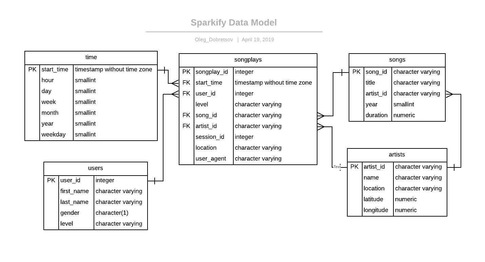

# Sparkify Database Model & ETL Project
## Introduction

This project is about creating an analytical database for a startup **Sparkify** which runs a music streaming app. The project goal is to enable Sparkify analitics team to easily understand customer listening behaviour and patterns through standard database queries and/or BI tools.

Currenly, all user acitivies data is stored on a file system as JSON files. In order to archieve project goals, we need to:  
1. Design a database schema  
2. Create database tables
2. Implement ETL pipeline to populate tables from JSON files

## Data Sources

Raw data is stored as JSON files on local file system. There are 2 data sources available:  
#### 1. Song Dataset  (/data/song_data)
This dataset contains metadata about a song and the artist of that song. The files are partitioned by the first three letters of each song's track ID. For example, here are filepaths to two files in this dataset.

        song_data/A/B/C/TRABCEI128F424C983.json
        song_data/A/A/B/TRAABJL12903CDCF1A.json
 Below is an example of what a single song file looks like.

    {"num_songs": 1, "artist_id": "ARJIE2Y1187B994AB7", "artist_latitude": null, "artist_longitude": null, "artist_location": "", "artist_name": "Line Renaud", "song_id": "SOUPIRU12A6D4FA1E1", "title": "Der Kleine Dompfaff", "duration": 152.92036, "year": 0}

#### 2. Log Dataset (data/song_data)
Containt information on user acitiviies in steaming app. Files are partitioned by year and month.
Below in an example of data in this dataset:

    {"artist":null,"auth":"Logged In","firstName":"Walter","gender":"M","itemInSession":0,"lastName":"Frye","length":null,"level":"free","location":"San Francisco-Oakland-Hayward, CA","method":"GET","page":"Home","registration":1540919166796.0,"sessionId":38,"song":null,"status":200,"ts":1541105830796,"userAgent":"\"Mozilla\/5.0 (Macintosh; Intel Mac OS X 10_9_4) AppleWebKit\/537.36 (KHTML, like Gecko) Chrome\/36.0.1985.143 Safari\/537.36\"","userId":"39"}
    {"artist":null,"auth":"Logged In","firstName":"Kaylee","gender":"F","itemInSession":0,"lastName":"Summers","length":null,"level":"free","location":"Phoenix-Mesa-Scottsdale, AZ","method":"GET","page":"Home","registration":1540344794796.0,"sessionId":139,"song":null,"status":200,"ts":1541106106796,"userAgent":"\"Mozilla\/5.0 (Windows NT 6.1; WOW64) AppleWebKit\/537.36 (KHTML, like Gecko) Chrome\/35.0.1916.153 Safari\/537.36\"","userId":"8"}
    {"artist":"Des'ree","auth":"Logged In","firstName":"Kaylee","gender":"F","itemInSession":1,"lastName":"Summers","length":246.30812,"level":"free","location":"Phoenix-Mesa-Scottsdale, AZ","method":"PUT","page":"NextSong","registration":1540344794796.0,"sessionId":139,"song":"You Gotta Be","status":200,"ts":1541106106796,"userAgent":"\"Mozilla\/5.0 (Windows NT 6.1; WOW64) AppleWebKit\/537.36 (KHTML, like Gecko) Chrome\/35.0.1916.153 Safari\/537.36\"","userId":"8"}

## Database Schema Design

For this project we choose to implement **Star Schema** data warehousing model due to its simplicity and ease of use.  We will use PostgreSQL as RDBMS for physical implementation.
The target database design will be the following:  
### Fact Tables:

- **songplays** - transactional fact table for streaming user activity: one record per each user action (like playing song)
  
### Dimension tables

- **users** is a dictionary of all app users
- **songs** represents a song library
- **artists** - list of all artists
- **time** - supplemental time dimension with explicit date parts (hour, day, week, etc.) for analytical purposes

Complete database ER model is represented below:



## ETL Pipelines

To implement ETL pipeline we will process each source JSON file by Python scripts,  parse it and insert data into our designed data tables. 
Here is the overall logic of ETL processing:  

- Process **Song** data
    - Iterate through all files in /data/song_data/. For each file found:
        - Identify song attributes and insert new recors into **songs** dimension
        - Identify artist attributes and insert new recors into **artists** dimension
- Process **Log** data
    - Iterate through file in /data/song_data. For each file found:
        - Process time attributes and populate **time** dimension
        - Select user attributes and populate **users** dimensions
        - Insert new records info **songplay** fact table. To get song_id and artist_id we will have to join to previously populated **songs** and **artists** tables  

***General notes on ETL:***

- Handling of duplicates (existsing records) while populating dimensions will be done on DBMS side.

### Summary of ETL logic:
 
| Table | Type | Source Data | Record Update Strategy |
| --- | -- | -- | -- |
| ***songplays*** | Fact | /song_data/ | Append |
| ***users*** | Dimension | /song_data/ | Merge (skip if exists) |
| ***songs*** | Dimension | /song_data/ | Merge (skip if exists) |
| ***artists*** | Dimension | /song_data/ | Merge (skip if exists) |
| ***time*** | Dimension | /song_data/ | Merge (skip if exists) |

## Repository structure
    
The repository consists of the following files:

- **/data** - directory with raw data (JSON), as described above
- **create_tables.py** - Python script to re-create PostgreSQL database and target tables
- **sql_queries.py** - supplementary Python script, used in create_tables.py. Contains declared variables with sql queries for creating and populating data tables  
- **etl.py** - main script to run ETL process. Reads and process source json files and loads data into target database tables
- **etl.ipynb** - Jupyter notebook used for testing/debugging ETL process step-by-step on sample data. Not used in production ETL.
- **test.ipynb** - Jupyter notebook which displays first few row of each table. Used to check the results of ETL pipeline.

## Run instructions

Instruction to execute ETL process:

1. Run **create_tables.py** to re-create database and all target tables.

        python create_tables.py
        
    It should print out a message that database has been created. Overwise, an exception will be raised and printed to console.
2. Run **etl.py** to execute main ETL task and process all files in /data dorectory:

        python etl.py

    The script will print its progress while iterating through files (first *song_data*, then *log data*). In case of exception, an error message will be printed.
3. Check the result of etl pipeline by looking at the table data
    - Open **test.ipynb** in Jupyter Notebook
    - Run cells one-by-one to view first few rows of each table

## Example of analytical queries 
Here are examples of few questions that can be ansered by Sparkify analytics team using the newly created database

#### Which songs are played the most?
```sql
-- Select top 10 songs played ever
select 
    a."name" as artsist_name,
    s.title as song_title,
    count(*) as plays_qty
from songplays p
join artists a on (p.artist_id = a.artist_id)
join songs s on (p.song_id = s.song_id)
group by 1,2
order by 3 desc
limit 10;
```

#### What are the most popular artists?
```sql
select 
	a."name" as artsist_name,
	count(*) as plays_qty
from songplays p
join artists a on (p.artist_id = a.artist_id)
group by 1
order by 2 desc
limit 10;
```
#### Which users are the mpost active in app?
```sql
-- Select top 10 active users
select 
	u.first_name,
	u.last_name,
	u."level",
	count(*) as plays_qty
from songplays p
join users u on (p.user_id = u.user_id)
group by 1,2,3
order by 4 desc
limit 10;
```
|first_name|last_name|level|plays_qty|
|----------|---------|-----|---------|
|Cuevas|Chloe|free|689|
|Levine|Tegan|paid|665|
|Harrell|Kate|paid|557|
|Koch|Lily|paid|463|
|Kirby|Aleena|paid|397|
|Lynch|Jacqueline|paid|346|
|Griffin|Layla|paid|321|
|Klein|Jacob|paid|289|
|Rodriguez|Mohammad|free|270|
|Jones|Matthew|free|248|


## To-Do
- Implement exception handling and print user-friendly messages
- Move configurable options (e.g. paths, connection string, etc.) to config files.
- Store database credentials in a secure manner, get rid of hard-coding l/p
- Implement bulk load data using COPY FROM command (+staging tables)
